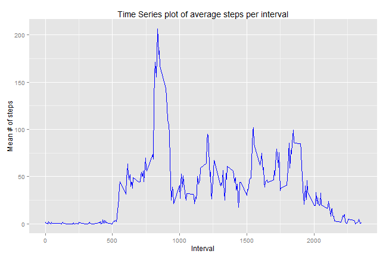

<br>

### Global settings

```r
echo = TRUE  # Makes all code visible unless specifically turned off withina  chunk.
options(scipen = 1)  # Turns off scientific notations for numbers.
```
<br>

###Loading and preprocessing the data
<br>
1. Unzip and load the data


```r
if(!file.exists('activity.csv')){
    unzip('activity.zip')
}
activity_data <- read.csv('activity.csv')

str(activity_data)
```

```
## 'data.frame':	17568 obs. of  3 variables:
##  $ steps   : int  NA NA NA NA NA NA NA NA NA NA ...
##  $ date    : Factor w/ 61 levels "2012-10-01","2012-10-02",..: 1 1 1 1 1 1 1 1 1 1 ...
##  $ interval: int  0 5 10 15 20 25 30 35 40 45 ...
```
<br>
2. Tidy the data by converting the date column from "factor" to date class and omit rows with "NA"


```r
activity_data$date <- as.Date(activity_data$date, format = "%Y-%m-%d")
omit_NA_data <- na.omit(activity_data)
```
<br><br>

### What is mean total number of steps taken per day? 
*(with NAs omitted)*

<br>

#### 1.  Histogram of total steps taken per day

<br>

Use aggregate function to aggregate the total steps by date, plot steps/day and perform calculations.


```r
steps_per_day <- aggregate(steps ~ date, data=omit_NA_data, FUN = "sum")

library(ggplot2)

ggplot(steps_per_day, aes(x = steps)) + 
       geom_histogram(fill = "skyblue", binwidth = 1000) + scale_color_hue(l=80) +
        labs(title="Histogram of steps per Day", x = "Steps", y = "Count with binwidth 1000")
```

 
<br>

#### 2.  Mean and Median of total steps Per Day 


```r
mean1 <-round(mean(steps_per_day$steps), digits=2)
mean1
```

```
## [1] 10766.19
```

```r
median1 <- round(median(steps_per_day$steps), digits=2)
median1
```

```
## [1] 10765
```
<br>

#### The mean # of steps per day is **10766.19** steps.  The median is **10765** steps

<br><br>

### What is the average daily activity pattern?

<br>

#### 1.  Make a time series plot (i.e. type = "l") of the 5-minute interval (x-axis) and the average number of steps taken, averaged across all days (y-axis)
<br>
Aggregate steps by interval and apply mean function.  Plot time series plot of interval vs mean steps per interval


```r
steps_per_int <- aggregate(steps ~ interval, data=omit_NA_data, FUN = "mean")
steps_per_int$interval <- as.numeric(as.character(steps_per_int$interval))
names(steps_per_int)[2] <- "IntMeansteps"

ggplot(steps_per_int, aes(x = interval, y = IntMeansteps)) + geom_line(color="blue") + 
      labs(title="Time Series plot of average steps per interval", x = "Interval", y = "Mean # of steps")
```

 
<br>

#### 2. Which 5-minute interval, on average across all the days in the dataset, contains the maximum number of steps?


```r
max_int <- steps_per_int[which.max(steps_per_int$IntMeansteps),]
max_int
```

```
##     interval IntMeansteps
## 104      835     206.1698
```

```r
max_interval <- max_int$interval
max_intmeansteps <- round(max_int$IntMeansteps, digits=2)
```
<br>

#### The 5-minute interval with maxium number of steps on average is **835** with **206.17** steps

<br><br>

### Imputing missing values
<br>

#### 1.  Calculate and report the total number of missing values in the dataset (i.e. the total number of rows with NAs)


```r
total_NAs <- sum(is.na(activity_data$steps))
total_NAs
```

```
## [1] 2304
```
<br>

#### **2304** rows have NA values.

<br>

#### 2.  Devise a strategy for filling in all of the missing values in the dataset. The strategy does not need to be sophisticated.         For example, you could use the mean/median for that day, or the mean for that 5-minute interval, etc.

<br>

#### 3.  Create a new dataset that is equal to the original dataset but with the missing data filled in.

We will use mean steps per interval over days to replace the missing value of same interval.  Since mean and median of rest of the data is about the same, either metric could be used without producing drastically different results.


```r
imputed_data <- activity_data 
for (i in 1:nrow(imputed_data)) {
    if (is.na(imputed_data$steps[i])) {
        imputed_data$steps[i] <- steps_per_int[which(imputed_data$interval[i] == steps_per_int$interval), ]$IntMeansteps
    }
}

sum(is.na(imputed_data))
```

```
## [1] 0
```

```r
str(imputed_data)
```

```
## 'data.frame':	17568 obs. of  3 variables:
##  $ steps   : num  1.717 0.3396 0.1321 0.1509 0.0755 ...
##  $ date    : Date, format: "2012-10-01" "2012-10-01" ...
##  $ interval: int  0 5 10 15 20 25 30 35 40 45 ...
```
<br>

#### 4.  Make a histogram of the total number of steps taken each day and Calculate and report the mean and median total number of steps taken per day. Do these values differ from the estimates from the first part of the assignment? What is the impact of imputing missing data on the estimates of the total daily number of steps? 


```r
imputed_stepsperday <- aggregate(steps ~ date, data=imputed_data, FUN = "sum")

ggplot(imputed_stepsperday, aes(x = steps)) + 
       geom_histogram(fill = "skyblue", binwidth = 1000) + scale_color_hue(l=80) +
        labs(title="Histogram of steps per Day (imputed data)", x = "Steps", y = "Count with binwidth 1000")
```

 
<br>

#### 4a. Mean and Median of total steps per day (imputed)


```r
mean2 <- round(mean(imputed_stepsperday$steps), digits=2)
mean2
```

```
## [1] 10766.19
```

```r
median2 <- round(median(imputed_stepsperday$steps), digits =2)
median2
```

```
## [1] 10766.19
```
<br>

#### The mean steps per day after imputed data is **10766.19**.  The median is **10766.19**   

<br>
The differences between imputed data and original estimates.


```r
delta1 <- mean1 - mean2

delta2 <- median1 - median2
```
<br>

#### The results from imputed data differ very slightly from original estimates with **0**  delta between means and **-1.19** delta between medians.

<br><br>

### Are there differences in activity patterns between weekdays and weekends?
<br>

#### 1. Create a new factor variable in the dataset with two levels -- "weekday" and "weekend" indicating dwhether a given date is a weekday or weekend day


```r
imputed_data$Day <-  ifelse(as.POSIXlt(imputed_data$date)$wday %in% c(0,6), 'weekend', 'weekday')
```
<br>

#### 2.  Make a panel plot containing a time series plot (i.e. type = "l") of the 5-minute interval (x-axis) and the average number of steps taken, averaged across all weekday days or weekend days (y-axis).


```r
stepsbydaytype <- aggregate(steps ~ interval + Day, data=imputed_data, FUN = "mean")

ggplot(stepsbydaytype, aes(x = interval, y = steps)) + geom_line(color="blue") + facet_grid(Day~.)+
      labs(title="Time Series plot of average steps per interval by day type", x = "Interval", y = "Mean # of steps")
```

 

